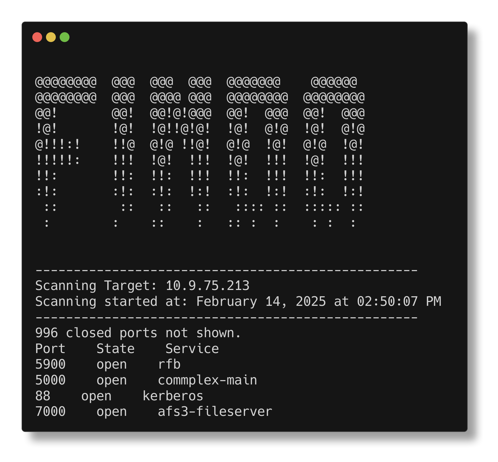
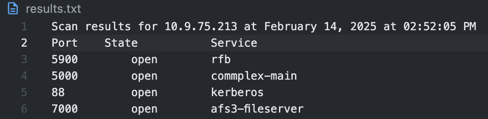

# Portfindo: A Magical Port Scanning Tool

Portfindo is a powerful and intuitive command-line tool designed to discover open ports on a target network. It supports stealthy port scanning and provides detailed information about the open ports, including the service name, making it a valuable tool for network security and penetration testing.

---

## Table of Contents

- [Installation](#installation)
- [Usage](#usage)
- [Features](#features)
- [Examples](#examples)
- [Scan Results](#scan-results)
- [Save Scan Results](#save-scan-results)
- [License](#license)

---

## Installation

To get started with **Portfindo**, you'll need Python 3.x installed on your system. If you don't have Python installed, you can download it from the official website: [python.org](https://www.python.org/).

To install **Portfindo**, follow these steps:

1. Clone the repository or download the project files.
2. Navigate to the project directory.
3. Install the dependencies using `pip`:

```bash
pip install -r requirements.txt
```

---

## Usage

Once installed, you can use **Portfindo** by running the following command in your terminal:

```bash
python portfindo.py <target>
```

### Arguments

- `-h`, `--help`: Show the help message.
- `-v`, `--version`: Display the version of Portfindo.
- `-sS`, `--scan-stealth`: Enable stealth mode to reduce detection by firewalls/IDS.
- `-p`, `--ports`: Specify the port range to scan (e.g., `53` or `22,80,443`).
- `-o`, `--output`: Save scan results to a `.txt` file.
- `-P`, `--protocol`: Specify the protocol to scan (`tcp` or `udp`).
- `<target>`: The target IP address to scan (e.g., `192.168.1.1`).

---

## Features

- **TCP SYN Scan**: Perform stealth scans to detect open ports without establishing full connections.
- **TCP Connect Scan**: Traditional scan to detect open ports by establishing full connections.
- **Service Detection**: Identifies services running on open ports through banner grabbing and service name lookup.
- **Save Scan Results**: Save your scan results to a file for later analysis.

---

## Examples

### Basic Scan

To scan a target IP address:

```bash
python portfindo.py 10.9.75.213
```

### Scan Specific Ports

To scan specific ports (e.g., 22, 80, 443):

```bash
python portfindo.py -p 22,80,443 10.9.75.213
```

### Stealth Mode

To scan in stealth mode (TCP SYN scan):

```bash
python portfindo.py -sS 10.9.75.213
```

### Save Scan Results

To save the scan results to a file:

```bash
python portfindo.py 10.9.75.213
```

---

## Scan Results

After running the scan, you will receive a detailed output of open ports and services. Here’s an example of what the results will look like:



---

## Save Scan Results

You can save the scan results to a `.txt` file by using the `-o` argument. This will allow you to analyze the results later.

For example:

```bash
python portfindo.py -o results 10.9.75.213
```

The results will be saved in a file named `results.txt`.



---

## License

This project is licensed under the MIT License - see the [LICENSE](LICENSE) file for details.
